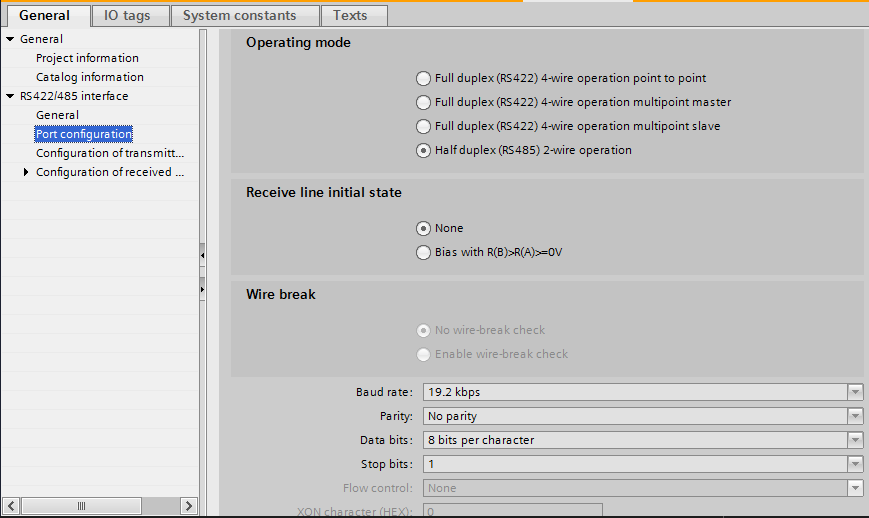
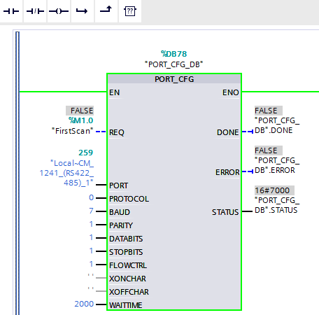
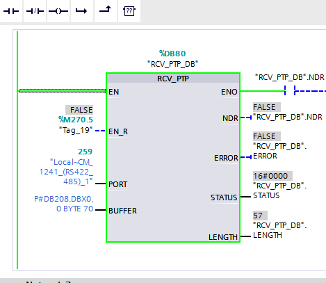
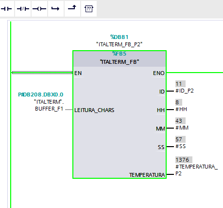

# S71200-INDICMAX-RS485-Freeport

**Descrição:** Projeto TIA Portal para integração de um medidor de temperatura INDICMAX NET (Italterm) com CLP Siemens S7-1200 via comunicação serial RS485 (protocolo Freeport).

---

## Sumário

* [1. Visão Geral do Sistema](#1-visão-geral-do-sistema)
* [2. Pré-requisitos](#2-pré-requisitos)
* [3. Configuração Física (Hardware)](#3-configuração-física-hardware)
    * [3.1. Cablagem RS485 (2 Fios)](#31-cablagem-rs485-2-fios)
    * [3.2. Terminação RS485 (120 Ohms)](#32-terminação-rs485-120-ohms)
* [4. Configuração no TIA Portal (Software)](#4-configuração-no-tia-portal-software)
    * [4.1. Configuração da Interface CM 1241 no Hardware (Device Configuration)](#41-configuração-da-interface-cm-1241-no-hardware-device-configuration)
    * [4.2. Programação no TIA Portal (Blocos de Comunicação)](#42-programação-no-tia-portal-blocos-de-comunicação)
        * [4.2.1. Bloco `PORT_CFG` (Configuração da Porta)](#421-bloco-port_cfg-configuração-da-porta)
        * [4.2.2. Bloco `RCV_PTP` (Recepção de Dados)](#422-bloco-rcv_ptp-recepção-de-dados)
        * [4.2.3. Bloco `ITALTERM_FB` (Função de Parsing do Telegrama)](#423-bloco-italterm_fb-função-de-parsing-do-telegrama)
* [Documentação Adicional](#documentação-adicional)

---

## 1. Visão Geral do Sistema

O sistema consiste em:
* **Medidor de Temperatura INDICMAX NET (Italterm):** Possui **saída RS485 nativa** e envia automaticamente o telegrama de medição a cada ciclo de medição. Atua como um transmissor autônomo.
* **CLP Siemens S7-1200:** Atua como receptor (cliente), aguardando e interpretando os dados de temperatura. Ele utiliza um módulo de comunicação serial **CM 1241 (código 6ES7 241-1CH32-0XB0, versão V2.2)**.
* **Comunicação:** Serial RS485 de 2 fios, utilizando o protocolo **Freeport** para a troca de telegramas.

## 2. Pré-requisitos

* CLP Siemens S7-1200 com módulo de comunicação **CM 1241 (6ES7 241-1CH32-0XB0 V2.2)**.
* Software TIA Portal (v15 ou superior, conforme seu projeto).
* Medidor de Temperatura INDICMAX NET com saída RS485.
* Cabo de par trançado blindado para RS485 (ex: Cat5e ou cabo de instrumentação).
* **Opcional, mas recomendado para entendimento:** Manual de Comunicação Serial (Protocolo) do INDICMAX NET, caso deseje compreender a estrutura interna do telegrama decodificado pelo projeto.

## 3. Configuração Física (Hardware)

### 3.1. Cablagem RS485 (2 Fios)

A conexão RS485 entre a **saída RS485 nativa do INDICMAX NET** e o módulo CM 1241 do S7-1200 deve ser realizada da seguinte forma:

* Conecte o terminal **A (ou D-)** da saída RS485 do INDICMAX NET ao terminal **A (ou D-)** do CM 1241.
* Conecte o terminal **B (ou D+)** da saída RS485 do INDICMAX NET ao terminal **B (ou D+)** do CM 1241.
* **Opcional/Recomendado:** Se disponível nos terminais RS485 do INDICMAX NET e no módulo CM 1241, conecte o terminal **GND (Terra de Sinal)** de ambos os dispositivos para estabelecer uma referência comum de terra e melhorar a imunidade a ruídos. Consulte os manuais específicos do INDICMAX NET e CM 1241 para a pinagem exata.

**Recomendações de Cablagem:**
* Utilize um cabo de **par trançado blindado**.
* Mantenha o comprimento do cabo dentro dos limites recomendados para RS485 (até 1200 metros, dependendo da velocidade).
* Evite rotear o cabo RS485 próximo a fontes de ruído elétrico (cabos de potência, inversores de frequência).

### 3.2. Terminação RS485 (120 Ohms)

Para evitar reflexões de sinal que podem causar erros de comunicação, resistores de terminação de **120 Ohms** devem ser instalados nas **duas extremidades** da rede RS485.

* Verifique os manuais do **INDICMAX NET** e do CM 1241 (S7-1200):
    * Muitos dispositivos e módulos possuem chaves DIP ou configurações internas para habilitar a terminação.
    * Se não possuírem, adicione um resistor de 120 Ohms externamente entre os terminais A e B em cada dispositivo que representa uma extremidade da rede (neste caso, o INDICMAX NET e o CM 1241).

## 4. Configuração no TIA Portal (Software)

### 4.1. Configuração da Interface CM 1241 no Hardware (Device Configuration)

1.  No TIA Portal, abra a "Device Configuration" do seu S7-1200.
2.  Adicione e selecione o módulo de comunicação **CM 1241 (6ES7 241-1CH32-0XB0 V2.2)** na árvore de dispositivos.
3.  Nas propriedades do CM 1241 (aba "General" -> "RS422/485 interface" -> "Port configuration"), configure os parâmetros de comunicação serial.

    **NOTA:** As configurações realizadas nesta tela de hardware (Device Configuration) geralmente são sobrescritas pelos parâmetros fornecidos ao bloco `PORT_CFG` no seu programa. No seu projeto, as configurações do `PORT_CFG` coincidem com as configurações padrão da interface RS485 no hardware, o que garante consistência.

    **Exemplo de Configuração de Hardware:**
    

### 4.2. Programação no TIA Portal (Blocos de Comunicação)

Para comunicação Freeport, você utilizará os blocos `PORT_CFG` e `RCV_PTP`.

#### 4.2.1. Bloco `PORT_CFG` (Configuração da Porta)

Este bloco é crucial e deve ser executado apenas uma vez, na inicialização do CLP, para configurar a porta serial. **Os parâmetros aqui definidos são os que o CM 1241 utilizará.**

* **Localização:** Geralmente no `OB1` (Main) ou em um bloco de organização/função chamado na inicialização.
* **Parâmetros (Baseados na imagem `italterm1.png` e correções precisas):**
    * `EN`: Conecte a um bit `FirstScan` (`%M1.0`) para execução única.
    * `PORT`: Identificador da sua porta CM 1241 (ex: `259` ou o nome simbólico como `"Local-CM_1241_(RS422_485)_1"`).
    * `PROTOCOL`: **`0` (Define o protocolo "Point-to-point communication protocol" - Freeport).**
    * `BAUD`: **`7` (Corresponde a 19200 bps).**
    * `PARITY`: **`1` (Corresponde a "No parity" - padrão).**
    * `DATABITS`: **`1` (Corresponde a "8 bits per character" - padrão).**
    * `STOPBITS`: **`1` (Corresponde a "1 stop bit" - padrão).**
    * `FLOWCTRL`: **`1` (Corresponde a "None" para controle de fluxo - padrão).**
    * `WAITTIME`: `2000` (tempo de espera em ms).

    **Exemplo do Bloco PORT_CFG:**
    

    **Verificação:** Garanta que o medidor INDICMAX NET esteja configurado com as seguintes características de comunicação para que o PLC possa se comunicar com ele:
    * **Baud Rate:** `19200 bps`
    * **Parity:** `No parity`
    * **Data Bits:** `8`
    * **Stop Bits:** `1`
    * **Flow Control:** `None`

#### 4.2.2. Bloco `RCV_PTP` (Recepção de Dados)

Este bloco é responsável por receber os dados brutos enviados automaticamente pelo INDICMAX NET. Ele deve ser chamado ciclicamente para verificar se há novos dados.

* **Localização:** Geralmente em um FC/FB dedicado à comunicação ou diretamente no `OB1`.
* **Parâmetros:**
    * `EN_R`: Um bit para habilitar a recepção (ex: `Clock 1s` ou uma tag específica para disparo cíclico).
    * `PORT`: O mesmo identificador da porta CM 1241.
    * `BUFFER`: Um ponteiro para uma área de memória (Data Block - DB) onde os bytes recebidos serão armazenados.
        * Ex: `P#DB208.DBX0.0 BYTE 70` (onde `DB208` é seu DB de dados, `DBX0.0` é o início e `BYTE 70` é o tamanho máximo do buffer). O tamanho do buffer deve ser igual ou maior que o maior telegrama esperado.
    * `NDR`: Saída que fica TRUE quando novos dados são recebidos. Use esta saída para disparar a função de parsing (`ITALTERM_FB`).
    * `LENGTH`: Saída que indica o número de bytes realmente recebidos no `BUFFER`.

    **Exemplo do Bloco RCV_PTP:**
    

#### 4.2.3. Bloco `ITALTERM_FB` (Função de Parsing do Telegrama)

Este é um bloco de função (FB) **já implementado no projeto**, responsável por decodificar o telegrama proprietário do INDICMAX NET. Ele pega os bytes brutos recebidos pelo `RCV_PTP` e extrai as informações significativas.

* **Localização:** Chamado quando o `NDR` do `RCV_PTP` fica TRUE (ou seja, quando um novo telegrama completo é recebido).
* **Entradas:**
    * `EN`: Habilitado diretamente (conectado a `TRUE` ou similar), garantindo que o bloco sempre esteja ativo para processar os dados quando `NDR` for verdadeiro.
    * `BUFFER_F1`: O ponteiro para o mesmo buffer que o `RCV_PTP` usa (ex: `P#DB208.DBX0.0`).
* **Saídas:** As saídas deste bloco fornecem os valores decodificados:
    * `ID`: ID do equipamento.
    * `HH`, `MM`, `SS`: (Horas, Minutos, Segundos - se presente no telegrama).
    * `TEMPERATURA`: O valor da temperatura, já convertido para o formato **INTEIRO**.

    **Exemplo de Chamada do Bloco ITALTERM_FB:**
    

---

### Documentação Adicional

* [Manual Completo em PDF](docs/Manual_INDICMAX_S71200.pdf)